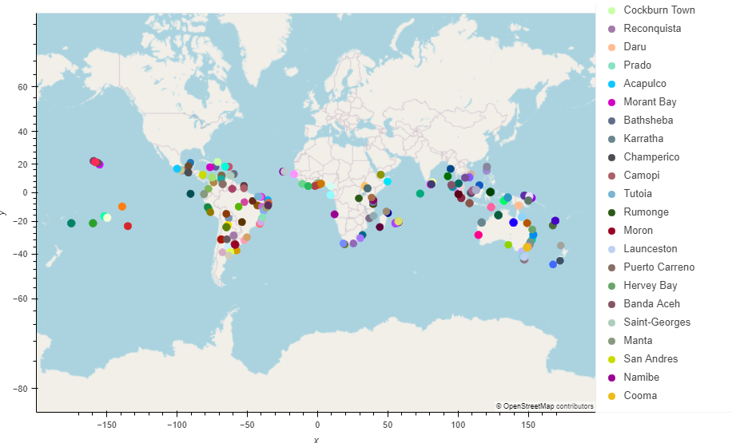
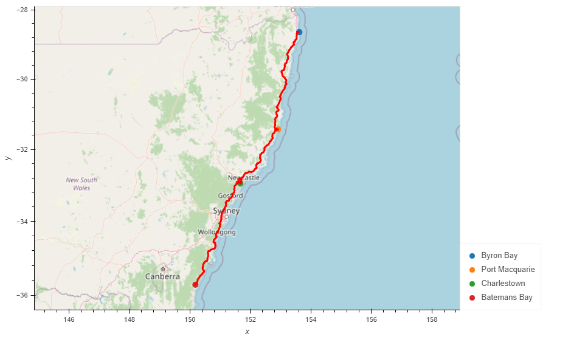

# World_Weather_Analysis

### Project Overview
I've been asked by the head of analysis, Jack, of PLANMYTRIP (a top travel technology company) to help him collect and present data for customers via the search page, which will allow the client to filter the data based on their preferred travel criteria in order to find their ideal hotel anywhere in the world. Due to the overwhelming positive feedback from the beta testers, Jack has a couple of tweaks he would like made to the criteria such as adding a current weather description.

The beta testers will choose four cities from the list of potential destinations to create a travel itinerary and a travel route between the four cities and a marker layer map will be generated.

### Resources
- Date Source: WeatherPy_Database.csv & WeatherPy_vacation.csv
- Software: Python 3.7.6, Jupyter Notebook, CitiPy module, Atom 1.63.1

### Results

The beta testers chose a minimum temperature of 70 degrees Fahrenheit and a maximum of 90 degrees. This resulted in random locations that were near the equator or the southern hemisphere.

The itinerary for this trip is taking the client from Byron Bay, Australia to Port Macquarie for the second stop, Charlestown for the third stop, Batemans Bay for the final stop before returning them to Byron Bay to complete the trip.

### Summary

A client will have to keep in mind when using the tool as it is written the time of year it is when the client inputs their preferred temperature range for travel. If the client is wanting to do a Northern hemisphere vacation but still would like temperatures between 70 and 90 degrees Fahrenheit, they may have to wait until late winter, early spring to plan their trip since the tool pulls current temperatures. This can be a very powerful tool for travel and can help the average person to step out of their comfort zone to explore somewhere that they may not have normally chosen.
